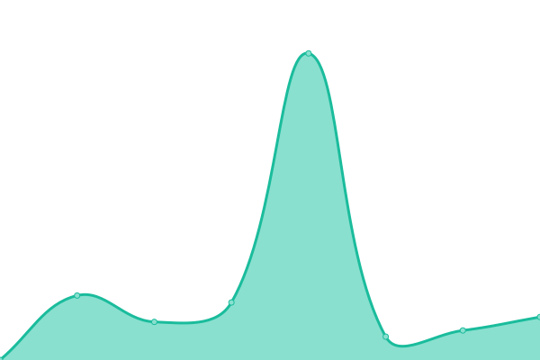

# [📈 Live Status](https://housemediadev.github.io/upptime): <!--live status--> **🟩 All systems operational**

This repository contains the open-source uptime monitor and status page for [Housemedia](https://housemedia.com.co).

We use [Issues](https://github.com/housemediadev/upptime/issues) as incident reports, [Actions](https://github.com/housemediadev/upptime/actions) as uptime monitors, and [Pages](https://housemediadev.github.io/upptime) for the status page.

<!--start: status pages-->
<!-- This summary is generated by Upptime (https://github.com/upptime/upptime) -->
<!-- Do not edit this manually, your changes will be overwritten -->
<!-- prettier-ignore -->
| URL | Status | History | Response Time | Uptime |
| --- | ------ | ------- | ------------- | ------ |
|  [Housemedia](https://housemedia.com.co) | 🟩 Up | [housemedia.yml](https://github.com/housemediadev/upptime/commits/HEAD/history/housemedia.yml) | 

 2190ms
     
 | 

<a href="https://housemediadev.github.io/upptime/history/housemedia">100.00%</a>
    

|  [Maggus](https://www.maggus.com.co) | 🟩 Up | [maggus.yml](https://github.com/housemediadev/upptime/commits/HEAD/history/maggus.yml) | 

 3561ms
     
 | 

<a href="https://housemediadev.github.io/upptime/history/maggus">100.00%</a>
    

|  [SHumantalent](http://shumantalent.com) | 🟩 Up | [s-humantalent.yml](https://github.com/housemediadev/upptime/commits/HEAD/history/s-humantalent.yml) | 

 2358ms
     
 | 

<a href="https://housemediadev.github.io/upptime/history/s-humantalent">100.00%</a>
    

|  [Colombialider](https://www.colombialider.org) | 🟩 Up | [colombialider.yml](https://github.com/housemediadev/upptime/commits/HEAD/history/colombialider.yml) | 

 798ms
     
 | 

<a href="https://housemediadev.github.io/upptime/history/colombialider">100.00%</a>
    

<!--end: status pages-->

[**Visit our status website →**](https://housemediadev.github.io/upptime)
